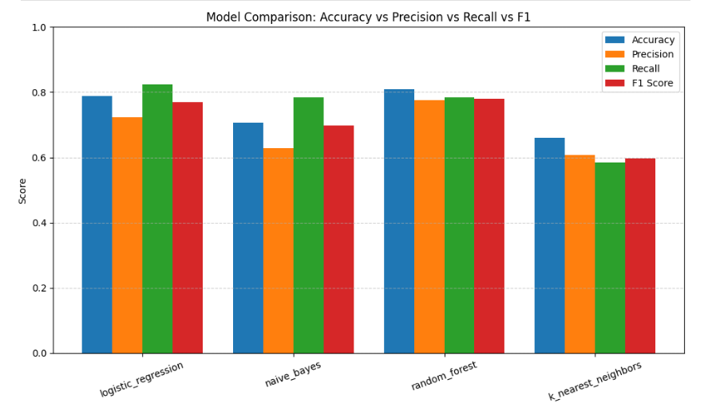

# 🛡️ Fullstack Fake News Detection
> An end-to-end Machine Learning solution for detecting misinformation, featuring a React frontend and a Scikit-Learn model deployed via Amazon SageMaker.

[](https://aws.amazon.com/)
[](https://reactjs.org/)
[](https://scikit-learn.org/)

---

## 🧐 Overview
This project, developed to  provide a robust system for classifying news articles as "Real" or "Fraudulent."

The system utilizes a Scikit-Learn model trained on the PolitiFact dataset, ensuring high reliability for political fact-checking. By leveraging a cloud-native AWS architecture, the application demonstrates how to bridge a modern web interface with high-performance machine learning inference.

The system is fully cloud-native, featuring a modern React frontend and a serverless Python backend deployed on AWS.
## 🏗️ System Architecture

The architecture is designed for scalability, security, and cost-efficiency, following a modern cloud-native approach.


### 🛰️ Core Components

* **Frontend Hosting (Amazon S3):** The **React** application is hosted as a static website on S3. This provides a low-cost, high-availability deployment without the need for traditional server management. It demonstrates that S3 is not just for storage, but an effective way to host modern web apps.
* **API Layer (Amazon API Gateway):** Acts as a secure **REST interface** between the frontend and the cloud backend. It exposes a `/prediction` endpoint under the `/prod` (Production) environment and handles the HTTP POST requests from the client.
* **Machine Learning Inference (Amazon SageMaker):** API Gateway forwards the text data to a deployed SageMaker endpoint. This endpoint hosts the **Scikit-Learn** model, performs real-time inference, and returns the classification result: **Real** or **Fraudulent**.
* **Storage (Amazon S3):** Used as the central repository for:
    1.  The static files of the React application.
    2.  The training data (PolitiFact dataset).
    3.  The final trained model artifacts.

---
## ✨ Key Features

* **PolitiFact-Powered Detection:** Unlike generic models, this system is specifically trained on the **PolitiFact dataset**, allowing for high-precision detection of political misinformation and fact-checked claims.
* **End-to-End AWS Integration:** A fully cloud-native pipeline leveraging **Amazon SageMaker** for scalable model hosting and **API Gateway** for secure request handling.
* **Real-Time Inference:** High-speed classification results via a dedicated REST API, providing instant "Real" or "Fraudulent" feedback to the user.
* **Serverless Efficiency:** Utilizes a cost-effective architecture by hosting the **React** frontend on **Amazon S3** and using managed services to minimize infrastructure maintenance.
* **Natural Language Processing (NLP):** Implements an optimized Scikit-Learn pipeline featuring **TF-IDF vectorization** and advanced text preprocessing for accurate feature extraction.
* **Production-Ready API:** Features a structured `/prod` environment deployment, demonstrating a professional MLOps workflow.

## ⚙️ MLOps & Deployment Pipeline

The project implements a fully automated CI/CD chain to transition from development to cloud production seamlessly.


### 🔄 Automated Workflow
The system architecture follows a dual-pipeline approach triggered by GitHub commits:
\

#### 1. Backend & Model Pipeline
* **Version Control:** Code managed in **GitHub** to ensure versioning and collaboration.
* **CI/CD Pipeline:** Triggered on every update to handle two critical tasks:
    * **Model Storage:** Uploading the newly trained Scikit-Learn model artifacts to **Amazon S3**.
    * **Containerization:** Building a **Docker image** containing the inference API and the necessary environment.
* **Artifact Registry:** The Docker image is pushed to **Amazon ECR (Elastic Container Registry)** for secure, centralized storage.
* **Serverless Inference:** The model is deployed via **Amazon SageMaker Serverless Inference**, allowing for automatic scaling and "pay-per-use" billing without managing underlying servers.

#### 2. Frontend Pipeline
* **React Build:** Each update triggers an automated pipeline that rebuilds the React application.
* **Optimization:** The pipeline cleans obsolete files and optimizes assets.
* **S3 Deployment:** The optimized production build is automatically synced to the **Amazon S3** bucket for immediate availability.

### 🛡️ Secure Communication Flow
* Users send an **HTTP POST** request via the React frontend.
* **API Gateway** acts as a secure proxy, relaying the request to the **SageMaker Serverless Endpoint**.
* The endpoint runs the inference and returns a "Real" or "Fraudulent" prediction back to the user interface.

## 🛠️ Tech Stack

### 💻 Frontend


### 🧠 Machine Learning & Backend


### ☁️ Cloud Infrastructure & MLOps


---
## 🧠 Model Training & Evaluation

The modeling phase followed a rigorous data science workflow to ensure the highest detection accuracy for the **PolitiFact** dataset.


### 🧪 Methodology
* **Data Splitting:** The dataset was partitioned into training and testing sets to evaluate performance on unseen examples.
* **Feature Engineering:** Raw text was converted into numerical vectors using **TF-IDF (Term Frequency-Inverse Document Frequency)**. This prioritized unique, high-value keywords while filtering out frequent, non-informative words.
* **Hyperparameter Tuning:** We utilized `RandomizedSearchCV` combined with **5-Fold Cross-Validation**. This allowed us to efficiently explore various parameter combinations and optimize the models without excessive computational overhead.

### 🤖 Algorithms Tested
We conducted a comparative study across four different algorithms:
1.  **Logistic Regression**
2.  **Naive Bayes**
3.  **K-Nearest Neighbors (KNN)**
4.  **Random Forest** (Selected Model)

### 📊 Performance Metrics : 


Given the significant class imbalance in the dataset (more "Fake" news samples than "Real"), we prioritized the **F1-Score** as our primary metric. This ensures a balanced evaluation of both **Precision** and **Recall**, providing a more realistic measure of model robustness.


| Algorithm | Precision | Recall | F1-Score |
| :--- | :--- | :--- | :--- |
| Logistic Regression | 0.78 | 0.76 | 0.77 |
| Naive Bayes | 0.72 | 0.70 | 0.71 |
| KNN | 0.68 | 0.65 | 0.66 |
| **Random Forest** | **0.81** | **0.79** | **0.80** |

### 🏆 Final Model Selection
The **Random Forest** classifier was selected as the final model. It outperformed the others with an **F1-score of approximately 80%**. The balanced metrics across the board suggest that the model generalizes well and does not suffer from underfitting, making it highly reliable for the production environment on AWS.

## 🚀 Model Deployment & Inference Workflow

To overcome library compatibility limitations in standard AWS images, a **custom Docker container** was engineered to provide a tailored environment for the Scikit-Learn model and its dependencies (NLTK, etc.).

### 🐳 Custom Docker Containerization
Since the specific requirements of our NLP pipeline weren't met by default AWS images, a custom image was built and pushed to **Amazon ECR**. This container follows the standard SageMaker structure:
* **Operating System:** Linux-based environment optimized for Python 3.
* **Model Path:** The model artifact is loaded into `/opt/ml/model`.
* **Inference Code:** The `inference.py` script is managed within `/opt/ml/code`.
* **Web Server:** Integration of a **Gunicorn** HTTP server running a **Flask** application to handle RESTful requests.

### 🛠️ Automated Deployment Lifecycle
The deployment is triggered via a `deploy.py` script using the SageMaker SDK, which automates the following lifecycle:

1. **Resource Provisioning:** SageMaker pulls the custom image from **ECR** and the trained model from **S3**.
2. **Privilege Delegation:** An **IAM Role** is assigned to the endpoint with specific permissions to access S3 and CloudWatch.
3. **Endpoint Creation:** A SageMaker Serverless endpoint is initialized, exposing the model for real-time predictions.

### 🔌 REST API Specification
The container exposes two essential endpoints to comply with the SageMaker hosting protocol:
* `GET /ping`: Health check endpoint used by SageMaker to monitor container status.
* `POST /invocations`: The primary inference endpoint used to submit news text and receive a **Real** or **Fraudulent** prediction.


## ⚙️ Automated CI/CD Deployment Workflow

The model deployment is fully automated using **GitHub Actions**, organized into two specialized, complementary workflows to ensure a clean separation of concerns.

### 🏗️ Workflow 1: Containerization & Registry 
* **Build:** Triggers on code changes to build a custom **Docker** image containing the inference engine, NLTK dependencies, and the Flask/Gunicorn server.
* **Push:** Authenticates with AWS and pushes the image to **Amazon ECR**.
* **Handover:** Automatically extracts the unique Image URL (URI) and passes it as an input to the secondary deployment workflow.

### 🚀 Workflow 2: SageMaker Provisioning
* **Environment Setup:** Installs the **SageMaker SDK** and configures deployment variables (Model Name, Execution Role, S3 Paths).
* **Execution:** Runs the `deploy.py` script which:
    * Creates a **SageMaker Model** object linked to the ECR image.
    * Synchronizes model artifacts with **Amazon S3**.
    * Deploys/Updates the **SageMaker Serverless Endpoint**.

---
## 📂 Project Structure

The project is organized into three main pillars: **Automation (CI/CD)**, **Frontend (Vite/React)**, and **Machine Learning (SageMaker/NLP)**.

```linux
.
├── .github/                      # CI/CD Automation
│   └── workflows/                # GitHub Actions Workflows
│       ├── build-image.yml       # Builds & Pushes Docker Image to ECR
│       ├── front-deploy.yml      # Automates React deployment to S3
│       └── ml-deploy.yml         # Manages SageMaker Endpoint updates
├── frontend/                     # Web Application
│   └── fake-news-detector-vite/  # React + Vite + TypeScript Frontend
│       ├── src/                  # Components, Hooks, and API logic
│       ├── public/               # Static web assets
│       ├── .env.production       # API Gateway production URL
│       └── vite.config.ts        # Vite configuration
├── ML/                           # Machine Learning & Backend
│   ├── src/                      # Core ML Logic & Deployment scripts
│   │   ├── Dockerfile            # Custom SageMaker-compatible container
│   │   ├── inference.py          # Flask/Gunicorn entry point for SageMaker
│   │   ├── deploy.py             # Script to provision AWS resources
│   │   ├── train.py              # SageMaker training script
│   │   ├── cleaner.py            # Text preprocessing (NLTK)
│   │   └── requirements.txt      # Python backend dependencies
│   ├── Models/                   # Serialized .joblib & .tar.gz artifacts
│   ├── Notebooks/                # EDA, Cleaning, and Training experiments
│   ├── Datasets/                 # PolitiFact raw and cleaned data
│   └── Config/                   # Hyperparameters and global settings
└── README.md                     # Project documentation
```

| Directory / File | Category | Description |
| :--- | :--- | :--- |
| **`.github/workflows/`** | **CI/CD** | Contains GitHub Actions for Docker builds (`build-image.yml`), React deployment (`front-deploy.yml`), and SageMaker updates (`ml-deploy.yml`). |
| **`frontend/`** | **Web UI** | The **Vite + React + TS** application. Includes `src/` for logic, `public/` for assets, and `.env` files for managing API Gateway URLs. |
| **`ML/src/`** | **Production ML** | Core scripts for the inference container: `Dockerfile` for the environment, `inference.py` for the Flask server, and `deploy.py` for AWS provisioning. |
| **`ML/Notebooks/`** | **R&D** | Jupyter Notebooks (`Cleaning.ipynb`, `Training.ipynb`) detailing the experimentation and model selection process. |
| **`ML/Datasets/`** | **Data** | Stores raw and preprocessed **PolitiFact** data files (`.csv`, `.zip`). |
| **`ML/Models/`** | **Artifacts** | Serialized model files (`.joblib`) and compressed archives (`.tar.gz`) ready for S3/SageMaker. |
| **`ML/Pipelines/`** | **Preprocessing** | Logic for data transformation and automated cleaning tasks. |
| **`ML/Config/`** | **Settings** | Configuration files such as `params.json` for model hyperparameters. |
| **`ML/requirements.txt`** | **Backend** | Python dependency list (Scikit-Learn, NLTK, Flask, Gunicorn) for the Docker container. |
| **`.gitignore`** | **Git** | Prevents large datasets, `node_modules`, and environment secrets from being pushed to the repository. |


## 🚀 Getting Started

Follow these steps to set up the project locally for development and testing.

### 📋 Prerequisites
* **Node.js** (v18 or higher)
* **Python** (3.12 or higher)
* **Docker** (For local container testing)

---

### 💻 1. Frontend Setup (React + Vite)
Navigate to the frontend directory and install dependencies:

```bash
# Go to the frontend folder
cd frontend/fake-news-detector-vite

# Install dependencies
npm install

# Create a local environment file
touch .env.local
```
### 💻 2. ML Setup 
```bash
# Go to the ML directory
cd ML/src

# Create and activate a virtual environment
python -m venv venv
source venv/bin/activate  # On Windows use: venv\Scripts\activate

# Install requirements
pip install -r requirements.txt

# Download necessary NLTK data
python -m nltk.downloader punkt stopwords

# IMPORTANT: Run the local download script located in Preprocessors
python Preprocessors/local_download.py
```
### 3. Run the backend server :
the `inference.py` devoted to run on an ECR container,In other word it is AWS-specific.
To run the model locally create a simple python file named `app.py`

```python

import joblib
from flask import Flask, request, jsonify
from flask_cors import CORS
import os

app = Flask(__name__)
CORS(app)  # Enable CORS so your React app can talk to this API

# 1. Load the model from your local Models folder
MODEL_PATH = os.path.join("..", "Models", "pipeline_model.joblib")
model = joblib.load(MODEL_PATH)

@app.route('/prediction', methods=['POST'])
def predict():
    try:
        data = request.get_json()
        text = data.get('text', '')
        
        # 2. Run prediction
        prediction = model.predict([text])[0]
        
        # Return the result (adjust keys to match your frontend)
        return jsonify({
            "status": "success",
            "prediction": str(prediction)
        })
    except Exception as e:
        return jsonify({"error": str(e)}), 500

if __name__ == '__main__':
    # Run on port 5000
    app.run(host='0.0.0.0', port=5000, debug=True)
```

Run the local server after then :
```bash
python app.py
```
### 3. Frontend Configuration (.env.local)
To tell your Vite app to use your local Flask server instead of the AWS cloud, update your environment file.

Update `frontend/fake-news-detector-vite/.env.local`:
```env
# Point to your local Flask server
VITE_API_URL=http://localhost:5000
```
### 4 Launch the frontend : 
```bash
npm run dev 
```

---

## 🖼️ User Interface : 
When the system is running correctly.The followinf webpage will be displayed : 


## 👥 Contributors

| Name | LinkedIn | GitHub |
| :--- | :---: | :---: |
| **Amine Es-saouiqui** | [](https://www.linkedin.com/in/amine-es-saouiqui) | [](https://github.com/ae-saouiqui) |
| **Menouar Chaima** | [](https://www.linkedin.com/in/chaima-menouar) | [](https://github.com/chamai1) |
| **Boukaidi Tarik** | [](https://www.linkedin.com/in/tarik-boukaidi) | [](https://github.com/tarik-boukaidi) |